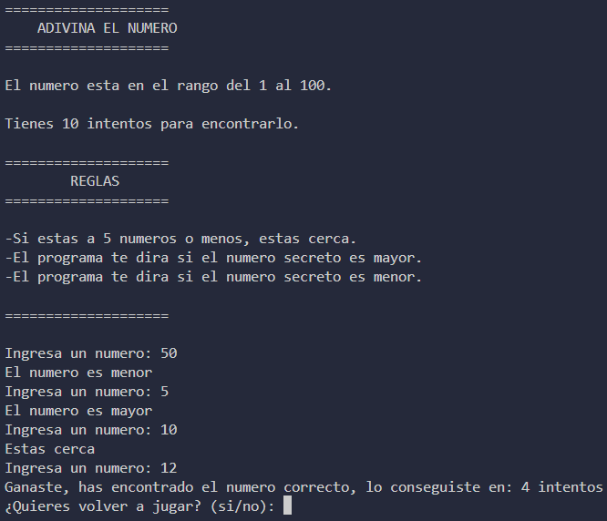

# ADIVINA EL NUMERO - PROYECTO PYTHON

## QUE HACE EL PROYECTO

El proyecto consiste en un juego desarrollado en Python en el que el jugador debe adivinar un número aleatorio generado mediante el módulo `random`.

El jugador tiene 10 intentos para encontrar el número secreto. Durante la partida, el programa proporciona diferentes pistas para ayudar al jugador a encontrarlo.

Si el jugador está a 5 números o menos del número secreto, el programa indica que está cerca. También indica si el número secreto es mayor o menor que el número ingresado.

## CARACTERISTICAS

* Generar un número aleatorio.
* Dar 10 oportunidades al jugador.
* Indicar si el jugador está a 5 números o menos del número secreto.
* Indicar si el número secreto es mayor o menor.
* Mostrar en cuántos intentos se consiguió el número.
* Mostrar el número secreto si el jugador pierde.
* Permitir volver a jugar.

## TECNOLOGIAS UTILIZADAS

* **Lenguaje de programación:** Python
* **Módulo utilizado:** `random`

## COMO EJECUTAR EL PROYECTO

1. Descargar o clonar el repositorio.
2. Instalar Python si todavía no está instalado.
3. Abrir una terminal en la carpeta del proyecto.
4. Ejecutar el siguiente comando:

```bash
python main.py
```

## COMO JUGAR

1. Ejecutar el programa.
2. Ingresar un número.
3. Utilizar las pistas proporcionadas por el programa.
4. Si el número está a 5 o menos de distancia del número secreto, aparecerá el mensaje "Estas cerca".
5. Si el número secreto es mayor o menor, el programa lo indicará.
6. El jugador tiene un máximo de 10 intentos.
7. Si encuentra el número, el programa indica que ganó y muestra la cantidad de intentos utilizados.
8. Si agota los 10 intentos, el programa indica que perdió y muestra el número secreto.
9. Al terminar la partida, el jugador puede elegir si quiere volver a jugar escribiendo `si` o `no`.

## CAPTURA DEL PROYECTO



## LO QUE APRENDI

* **Importar módulos:** aprendí cómo importar módulos que forman parte de la biblioteca estándar de Python.
* **Ciclos `while`:** aprendí a utilizar `while` para repetir partes del programa mientras se cumpla una condición.
* **Funciones de módulos:** aprendí a utilizar funciones proporcionadas por módulos, como `random.randint()`.
* **`abs()`:** aprendí que devuelve el valor absoluto de una cantidad y lo utilicé para calcular la distancia entre dos números.
* **`random.randint()`:** aprendí a generar un número aleatorio dentro de un rango determinado.
* **Contadores:** utilicé una variable para llevar el control de los intentos del jugador.
* **Condicionales:** utilicé `if`, `elif` y `else` para tomar decisiones dependiendo de los valores ingresados.

## AUTOR

Daniel Vega
